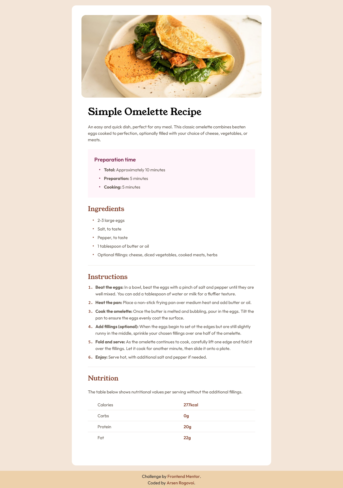

# Frontend Mentor - Recipe page solution


This is a solution to the [Recipe page challenge on Frontend Mentor](https://www.frontendmentor.io/challenges/recipe-page-KiTsR8QQKm). Frontend Mentor challenges help you improve your coding skills by building realistic projects. 

## Table of contents

- [Overview](#overview)
  - [Screenshot](#screenshot)
  - [Links](#links)
- [My process](#my-process)
  - [Built with](#built-with)
  - [What I learned](#what-i-learned)
- [Author](#author)

## Overview

### Screenshot



### Links

- [Solution URL](https://github.com/ArsenRogovoi/recipe-page-main)
- [Live Site URL](https://arsenrogovoi.github.io/recipe-page-main/)

## My process

### Built with

- Semantic HTML5 markup
- Mobile-first workflow
- [Tailwind CSS](https://tailwindcss.com/)

### What I learned

- How to declare and use variables in Tailwind

```css
@theme {
    --default-font-family: "Outfit";
    --font-young-serif: "YoungSerif";
    --color-white: hsl(0, 0%, 100%);
    --color-stone-100: hsl(30, 54%, 90%);
    --color-stone-150: hsl(30, 18%, 87%);
    --color-stone-600: hsl(30, 10%, 34%);
    --color-stone-900: hsl(24, 5%, 18%);
    --color-brown-800: hsl(14, 45%, 36%);
    --color-brown-hover: hsl(14, 45%, 46%);
    --color-rose-800: hsl(332, 51%, 32%);
    --color-rose-50: hsl(330, 100%, 98%);
    --color-footer: hsl(35, 64%, 80%);
    --color-background: #f3e5d8;
}
```

- How to style base elements in Tailwind

```css
@layer base {
    h2 {
        color: var(--color-brown-800);
        font-family: var(--font-young-serif);
        font-size: var(--text-2xl);
        font-weight: var(--font-weight-medium);
    }
}
```

## Author

- [Frontend Mentor](https://www.frontendmentor.io/profile/ArsenRogovoi)
- [GitHub](https://github.com/ArsenRogovoi)
- [LinkedIn](https://www.linkedin.com/in/arsen-rogovoi/)